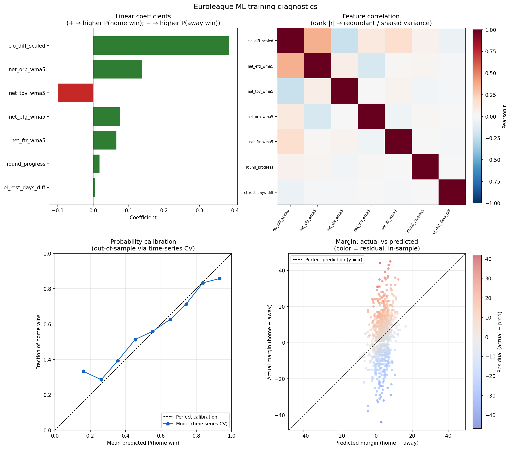

# Euroleague Prediction Model

## What this project does

This repo is a **EuroLeague basketball prediction pipeline**. It pulls game and box-score data via the EuroLeague API, builds team-level features (Elo, 5-game weighted recent form on four-factor rates, round progress, and **EuroLeague schedule rest**—capped days since the previous EL game, home minus away), and trains **ML models** from a **model registry** (default: calibrated logistic regression for home-win probability and ridge regression for expected margin). Predictions combine ML outputs with a **Monte Carlo** simulation over margin. You run everything through one CLI: `euroleague-sim`.

Model definitions and fixed hyperparameters live in `src/euroleague_sim/ml/registry.py`. Each trained model saves its own folder under `models/<model_name>/` (artifacts, `metadata.json`, and `diagnostics.png`).

## Conclusion

After Elo, the baseline logistic model leans most on **rebounding and ball security**: a positive weight on `net_orb_wma5` and a negative weight on `net_tov_wma5` mean that, holding Elo fixed, home teams look better when they crash the glass and take care of the ball relative to the visitor. **Effective shooting and free-throw rate** (`net_efg_wma5`, `net_ftr_wma5`) still help. **`el_rest_days_diff`** adds a small positive tilt when the home side has more EL rest than the away side; **`round_progress`** is often small in magnitude. See **Training diagnostics** below and `models/baseline/diagnostics.png` after you train.

## The 7 features

These are the columns fed to the ML models (see `src/euroleague_sim/ml/features.py`, `FEATURE_COLS`).

1. `elo_diff_scaled` — (Elo_home − Elo_away) / 25
2. `net_efg_wma5` — 5-game WMA recent form: eFG% (home − away); in training, `shift(1)` excludes the current game from the rolling window
3. `net_tov_wma5` — 5-game WMA recent form: TOV% (home − away)
4. `net_orb_wma5` — 5-game WMA recent form: ORB% (home − away)
5. `net_ftr_wma5` — 5-game WMA recent form: FT rate (home − away)
6. `round_progress` — round / max_rounds
7. `el_rest_days_diff` — capped EL rest days for home minus away



Coefficients, feature correlation, out-of-fold calibration, and margin scatter for the baseline model (run `euroleague-sim train --model baseline` to regenerate).

## Training diagnostics

Diagnostics are written per model when you run `euroleague-sim train --model <name>`:

- **Path:** `models/<model_name>/diagnostics.png` (e.g. `models/baseline/diagnostics.png`)
- **Contents:** feature importance (signed coefficients for linear win models; one-way bar chart for tree importances), correlation heatmap, calibration curve from time-series CV, margin fit scatter

Metrics for the run are also in `models/<model_name>/metadata.json` under `"metrics"`.

Example baseline hyperparameters (from the registry, not grid search at train time):

| Component | Setting |
| --- | --- |
| Win model | `CalibratedClassifierCV` over `LogisticRegression(C=0.3, …)` |
| Margin model | `Ridge(alpha=75)` |
| Scaling | `StandardScaler` when `requires_scaling` is true (baseline: yes) |

## How to run

### 1. Environment and install

```bash
python -m venv .venv
# Windows
.venv\Scripts\activate
# macOS/Linux
source .venv/bin/activate

pip install -r requirements.txt
pip install -e .
```

### 2. Typical workflow

```bash
# Fetch/cache data and build features (adjust --season to your competition year)
euroleague-sim update-data --season 2025

# Train the default registry model ("baseline") → writes models/baseline/
euroleague-sim train --season 2025 --model baseline

# Predict next unplayed round using that model
euroleague-sim predict --season 2025 --round next --model baseline
```

### 3. Model selection (`--model`)

| Command | Meaning |
| --- | --- |
| `train --model baseline` | Train one registry entry; save under `models/baseline/`. |
| `train --model all` | Run time-series CV for **every** entry in `MODEL_REGISTRY` and print a **leaderboard** (log-loss, Brier, accuracy, margin MAE/RMSE). Does **not** save artifacts. |
| `predict --model baseline` | Load `models/baseline/win_model.joblib`, `margin_model.joblib`, and scaler/metadata as needed. |

Default for both `train` and `predict` is `--model baseline` if you omit the flag.

Registered model keys are defined in `src/euroleague_sim/ml/registry.py` (`MODEL_REGISTRY`).

### 4. Other useful commands

Re-download data and rebuild cached features:

```bash
euroleague-sim update-data --season 2025 --force
```

Predict a specific round or change Monte Carlo draws:

```bash
euroleague-sim predict --season 2025 --round 22 --model baseline --n-sims 50000
```

Write predictions to a custom CSV:

```bash
euroleague-sim predict --season 2025 --round next --model baseline --out outputs/my_round.csv
```

Optional JSON config (paths, Elo, MC defaults, `ml.model_dir`, `ml.cv_folds`):

```bash
euroleague-sim --config my_config.json train --season 2025 --model baseline
```

Dump the default config:

```bash
euroleague-sim --dump-config default_config.json
```

### 5. Offline hyperparameter search

Heavy tuning is **not** part of `train`. For future Optuna / grid workflows, use the skeleton:

```bash
python -m euroleague_sim.ml.tune --help
```

(Implement trials there, then copy best parameters into `registry.py`.)

### 6. Artifacts layout

After `train --model baseline`:

```
models/baseline/
  scaler.joblib          # omitted if requires_scaling is false for that registry entry
  win_model.joblib
  margin_model.joblib
  metadata.json
  diagnostics.png
```

`model_dir` defaults to `models` (see `ProjectConfig` / `config.py`); each **named** model uses a subfolder under that root.
